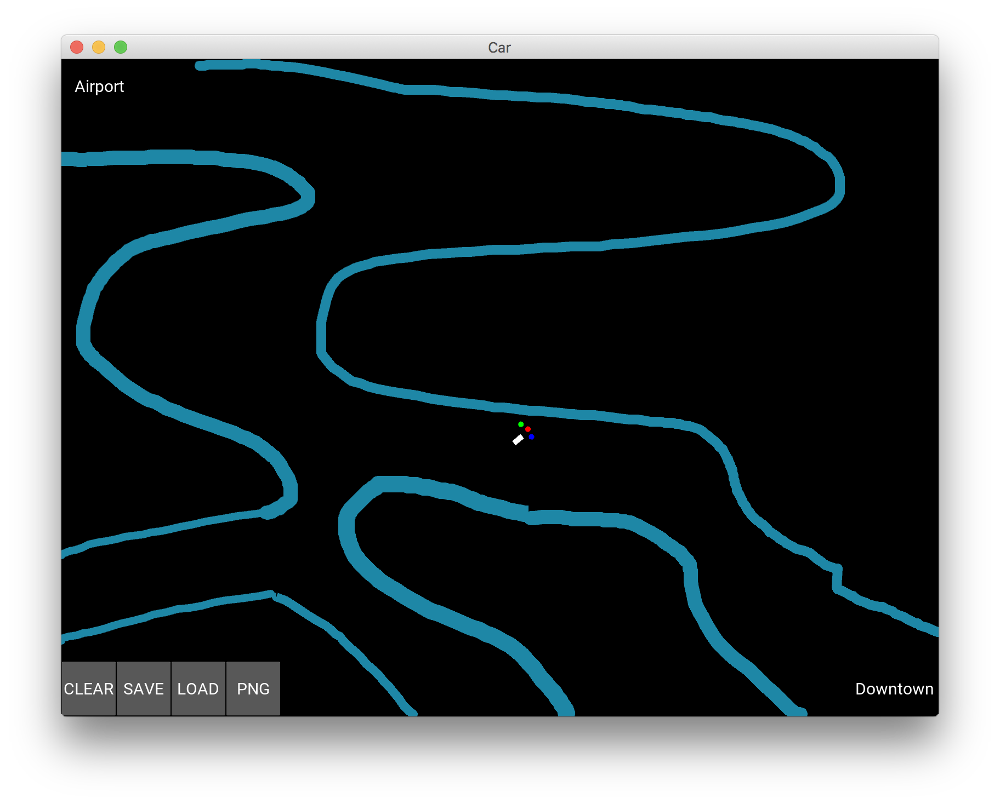

# Self Driving Car AI

This is a project of Artificial Intelligence Self Driving Car with 2D simulation.

## Getting Started

Please install both [Kivy](https://kivy.org/#download) and [PyTorch](https://pytorch.org/) to build the project.

## Dependencies

```
Kivy                               1.10.1.dev0
Kivy-Garden                        0.1.4
numpy                              1.14.3
torch                              0.4.0      
torchvision                        0.2.1
Python 3.6.4 :: Anaconda custom (64-bit)
```

## Running the App

```python
python map.py
```

## How to play

After running the Kivy canvas, you can hold on your left-mouse button to draw the line, therefore the car will be learning the path by [Deep Q-Learning Algorithm](https://en.wikipedia.org/wiki/Q-learning) and go back and forth between airport and downtown.

## Connecting the files

We first import `DQN` class from `ai.py`:

```python
from ai import DQN
```

Then we create `dqn` object from the `DQN` class:

```python
dqn = DQN(5, 3, 0.9)    # 5 signals, 3 actions, gamma = 0.9
```

- 5 signals is composed of 

    - three signals of the sensors
    - the orientation
    - the minus orientation

- 3 actions is composed of

    - go straight
    - go left
    - go right

Each time we select the right `action` to play by

```python
action = dqn.update(last_reward, last_signal)
```

where `last_signal` will be the input of the neural network.

```python
last_signal = [self.car.signal1, self.car.signal2, self.car.signal3, orientation, -orientation]
```

## Possible Improvements

When thinking about Self Driving Car and the [Markov Decision Process (MDP)](https://en.wikipedia.org/wiki/Markov_decision_process), there are two different things:

### Markov Decision Process (MDP)

In MDP we have a *goal*, *states* and *transitions* that have to lead to this goal. These *states* soak with *reward* when thanks to successful transitions between them.

### Self Driving Car (SDC)

In SDC we don't ever reward a brain when the **car** reaches either goal, that means, downtown or airport. Also no state is "adjacent" to these goals. We'd have to give a network (x, y) to have such states and let the network learn the map and the way.

### Conclusion

Instead, our goal is 

- getting closer to the target
- avoiding sand

This is why a maze which requires a **car** to get further from the destination for a while makes the brain failing. It's goal is to get closer, not to actually reach the target.

We can modify the goals:

1. Introducing cumulative reward. Instead of giving it a certain value, independent conditions sum up their rewards (which mostly are penalties).

    ```python
    last_reward = 0
    if sand[int(self.car.x),int(self.car.y)] > 0:
        self.car.velocity = Vector(1, 0).rotate(self.car.angle)
        last_reward += -3
    ```

2. Introducing penalty for turning. The model should keep its direction in more conservative way.

    ```python
    if action != 0:
        last_reward += -0.15
    ```

3. I replaced binary reward for closing to the target with continuous differential value. To let the brain keep direction, this reward is really low, yet still a clue for taking proper action.

    ```python
    last_reward += (last_distance - distance) / 250.0
    ```

4. Introducing a reward for sand detection by a yellow sensor. Max reward is when the sensor gives output in it's medium range (0.5). This is crucial: keeping side of the road the **car** will pass the spiral road. This also lets the **car** to pass other maze although makes it sticky which keeps it by separated obstacles for a while.

    ```python
    last_reward += -3 * (self.car.signal3 - 1.0) * (self.car.signal3)
    ```

5. Adding differential sensors signal to let the brain know if it's getting further or closer to the obstacle.

    ```python
    DQN = Dqn(8, 3, 0.9)        # Add three more signals
    last_signal = [self.car.signal1, self.car.signal2, self.car.signal3, 
                   last_signal1 - self.car.signal1, 
                   last_signal2 - self.car.signal2, 
                   last_signal3 - self.car.signal3, 
                   orientation, -orientation]
    ```

6. Lowering turning angles to +/-10 degrees to let the **car** be more precise

    ```python
    action2rotation = [0, 10, -10]
    ```

7. Building a network with 3 hidden layers and adding sigmoid function (Not sure if it really helps).

    ```python
    class Network(nn.Module):

        def __init__(self, input_size, nb_action):
            super(Network, self).__init__()
            self.input_size = input_size
            self.nb_action = nb_action
            self.fc1 = nn.Linear(input_size, 15)
            self.fc2 = nn.Linear(15, 20)
            self.fc3 = nn.Linear(20, 10)
            self.fc4 = nn.Linear(10, nb_action)

        def forward(self, state):
            l1 = F.relu(self.fc1(state))
            l2 = F.relu(self.fc2(l1))
            l3 = F.sigmoid(self.fc3(l2))
            q_values = self.fc4(l3)
            return q_values
    ```

## Screenshots

